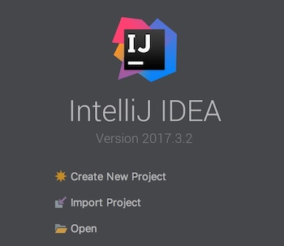
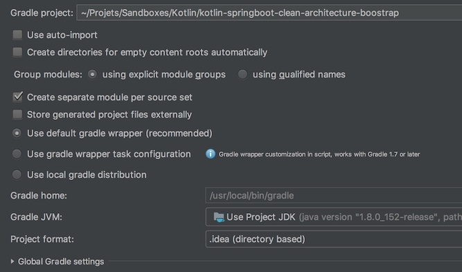

# Clean Architecture skeleton project for APIs using Spring Boot 2/Kotlin and Gradle

This repository is intended to be used as a bootstrap for implementing Clean Architecture compliant APIs with state-of-the-art Spring Boot and Kotlin.
In order to achieve such an ambition, your feedback (insight, criticism and suggestions) is highly welcome!

In order to illustrate the Clean Architecture principles, this skeleton implements a minimalistic and fictional use case of a ***Course enrollment platform*** with the given business rules:
* A ***Student*** may enrol him/herself to a ***Course*** if
  * The given ***Course*** is not already full (i.e. less than 5 ***Students*** are already enrolled to that ***Course***)
  * The ***Student*** is not already enrolled to the given ***Course***
  
Example API exposes a `POST /enrol-student-to-course` endpoint with 2 integer parameters:
* `studentId`  
* `courseId`

## Table of content
- [Dependencies](https://github.com/EGI-OCTO/clean-architecture-skeleton-kotlin-springboot/blob/master/README.md#dependencies)
- [Start-up](https://github.com/EGI-OCTO/clean-architecture-skeleton-kotlin-springboot/blob/master/README.md#start-up)
- [Output](https://github.com/EGI-OCTO/clean-architecture-skeleton-kotlin-springboot/blob/master/README.md#output)
- [Tests](https://github.com/EGI-OCTO/clean-architecture-skeleton-kotlin-springboot/blob/master/README.md#tests)
- [Directory Structure](https://github.com/EGI-OCTO/clean-architecture-skeleton-kotlin-springboot/blob/master/README.md#directory-structure)
- [Design decisions](https://github.com/EGI-OCTO/clean-architecture-skeleton-kotlin-springboot/blob/master/README.md#design-decisions)
- [Appendix : Import project into _IntelliJ IDEA Community_](https://github.com/EGI-OCTO/clean-architecture-skeleton-kotlin-springboot/blob/master/README.md#appendix--import-project-into-intellij-idea-community)

## Dependencies
[See here](build.gradle)

## Start-up
Run the following command:
```
gradle clean bootRun
```
_In the command above, `gradle` might be replaced  by `./gradlew`_

For the sake of the example, the application runs on a in-memory database which is populated on start-up with 6 ***Students*** (with IDs from 1 to 6) and 5 ***Courses*** (with IDs from 1 to 5).

You may thus for instance try the API using [_Postman_](https://www.getpostman.com) as shown here below :


## Output

### Nominal case (`200 OK`)
```
{
    "message": "Student #3 successfully enrolled to class #4"
}
```
### Non-existing course (`400 BAD REQUEST`)
```
{
    "message": "Cannot enrol student #3 to course #12 : course not found",
    "code": "ERR-1"
}
```
### Non-existing student (`400 BAD REQUEST`)
```
{
    "message": "Cannot enrol student #12 to course #4 : student not found",
    "code": "ERR-2"
}
```
### Course is full (`403 FORBIDDEN`)
```
{
    "message": "Cannot enrol student #6 to course #4 : course is full",
    "code": "ERR-3"
}
```
### Student is already enrolled (`403 FORBIDDEN`)
```
{
    "message": "Cannot enrol student #3 to course #4 : student is already enrolled",
    "code": "ERR-4"
}
```
### Type mismatch (`400 BAD REQUEST`)
```
{
    "error": "Bad Request",
    "status": 400,
    "path": "/enrol-student-to-course",
    "timestamp": "2018-06-27 13:42:02.699",
    "message": "Failed to convert 'hello' to required type 'long' for  argument 'studentId'",
    "code": "BAD-REQUEST-ERR-1"
}
```
### Missing parameter (`400 BAD REQUEST`)
```
{
    "error": "Bad Request",
    "status": 400,
    "path": "/enrol-student-to-course",
    "timestamp": "2018-06-27 13:41:37.262",
    "message": "Required long parameter 'studentId' is not present",
    "code": "BAD-REQUEST-ERR-2"
}
```

## Tests
Run the unit/integration tests using:
```
gradle clean test
```

Generate the [`pitest` mutation testing](http://pitest.org) report using:
```
gradle pitest
``` 

An HTML report will be issued under the `./build/reports/pitest` directory. 

_In the commands above, `gradle` might be replaced  by `./gradlew`_

## Directory structure
```
|-src
   |--main
   |  |--kotlin
   |     |--api
   |        |--domain # contains domain entities and repositories interfaces
   |        |--infrastructure # contains technical implementations (db repo, spring boot)
   |        |  |--http
   |        |     |--routing # contains HTTP endpoint mapping and error handling mecanisms
   |        |--usecases # contains orchestration mecanisms
   |--test # contains unit- and integration tests
```

## Design decisions
- Persistence mapping is done using [boilerplate entities](./src/main/kotlin/api/infrastructure/db/course/Course.kt) and [conversions](./src/main/kotlin/api/infrastructure/db/course/CourseH2Repository.kt) in order to keep [domain](./src/main/kotlin/api/domain/course/Course.kt) free of external libraries/framework dependencies 
- Non-nominal execution flows are handled using `Exception` throwing and [`Exception handlers` from `ControllerAdvice`](./src/main/kotlin/api/infrastructure/http/routing/ControllerAdvice.kt)
- Naming relative to the verb "to Enrol" are spelled UK-style :)  

# Once again, your feedback is welcome !
***And if you found this repository useful, please give it a star :)***

## Appendix : Import project into _IntelliJ IDEA Community_

1. Clone or download the sources into a directory
2. Open _IntelliJ IDEA Community_
3. In the wizard press "Open":


4. In the next dialog  window select the options as show here:

5. Let _IntelliJ_ some time to synch with _Gradle_
6. At this point you should be all set. To make sure of that, go to `./test/kotlin/api/domain/CourseTest.kt` test class and run it from within _IntelliJ_ using the green arrow in the left margin:


